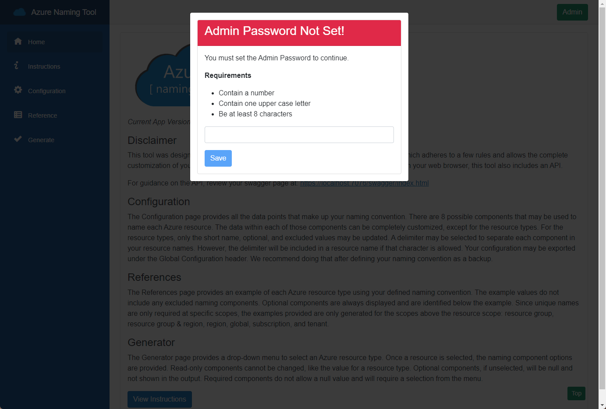
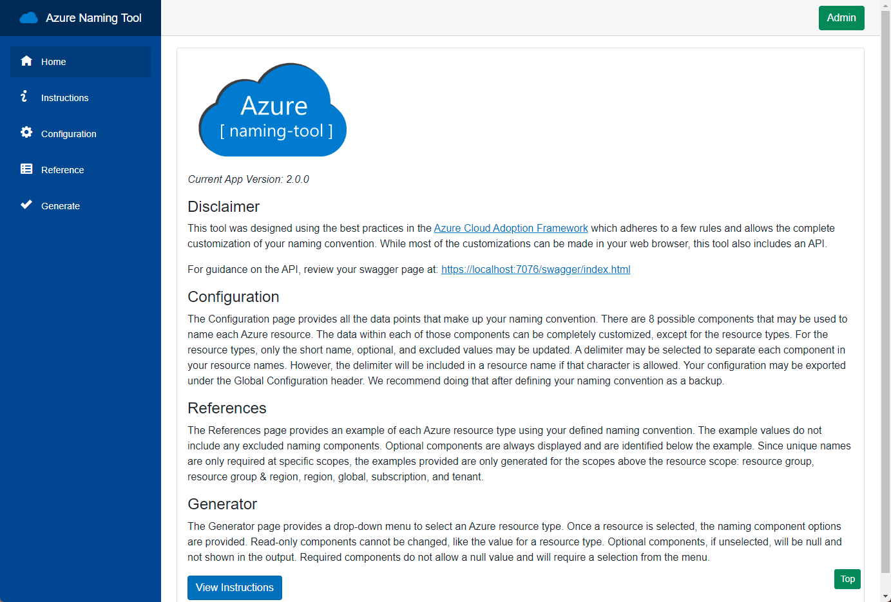
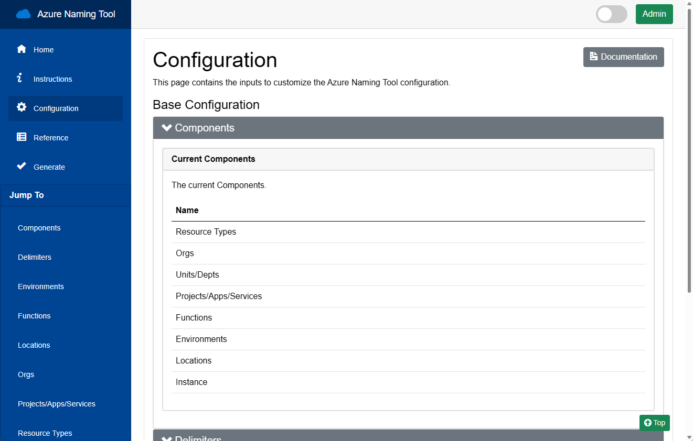
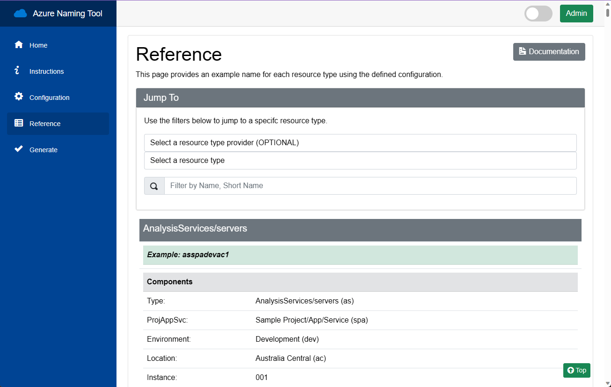

[Overview](/ready/AzNamingTool) | [Installation](INSTALLATION.md) | [Updating](UPDATING.md) | [Using the API](USINGTHEAPI.md)

# Azure Naming Tool v2 - Overview

[Overview](#overview)

[Project Structure](#project-structure)

[Important Notes](#important-notes)

[Pages](#pages)

## Overview

The Naming Tool was developed using a naming pattern based on [Microsoft's best practices](https://docs.microsoft.com/en-us/azure/cloud-adoption-framework/ready/azure-best-practices/naming-and-tagging). Once the organizational components have been defined by an administrator, users can use the tool to generate a name for the desired Azure resource.

## Project Structure

The Azure Naming Tool is a .NET 6 Blazor application, with a RESTful API. The UI consists of several pages to allow the configuration and generation of Azure Resource names. The API provides a programmatic interface for the functionality. The application contains Docker support, allowing the site to be run as a stand-alone application, or a container.

### Project Components

* UI/Admin
* API
* JSON configuration files
* Dockerfile

### Important Notes

The following are important notes/aspects of the Azure Naming Tool:

* The application is designed to run as a stand-alone solution, with no internet/Azure connection.
* The application can be run as a .NET 6 site, or as a Docker container.
* The site can be hosted in any environment, including internal or in a public/private cloud.
* The application uses local JSON files to store the configuration of the components.
* The application requires persistent storage. If running as a container, a volume is required to store configuration files.
* The application contains a *repository* folder, which contains the default component configuration JSON files. When deployed, these files are copied to the *settings* folder.
* The Admin interface allows configurations to be "reset", if needed. This process copies the configuration from the *repository* folder to the *settings* folder.
* The API requires an API Key for all executions. A default API Key (guid) will be generated on first launch. This value can be updated in the Admin section.
* On first launch, the application will prompt for the Admin password to be set.

  

## Pages

### Home Page

The Home Page provides an overview of the tool and the components.

### Configuration

The Configuration Page shows the current Name Generation configuration. This page also provides an Admin section for updating the configuration.

### Reference

The Reference Page provides examples for each type of Azure resource. The example values do not include any excluded naming components. Optional components are always displayed and are identified below the example. Since unique names are only required at specific scopes, the examples provided are only generated for the scopes above the resource scope: resource group, resource group & region, region, global, subscription, and tenant.

### Generate

The Generate Page provides a dropdown menu to select an Azure resource. Once a resource is selected, naming component options are provided. Read-only components cannot be changed, like the value for a resource type or organization. Optional components, if left blank, will be null and not shown in the output. Required components do not allow a null value, and the first value in the array is set as the default.

